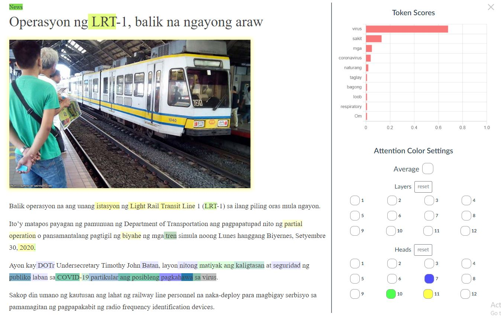
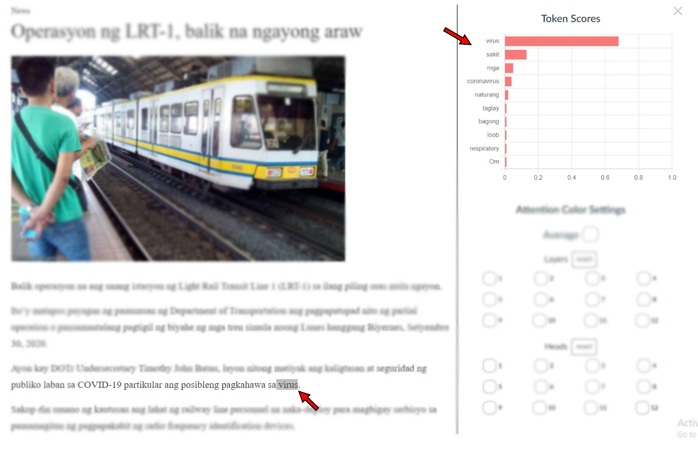
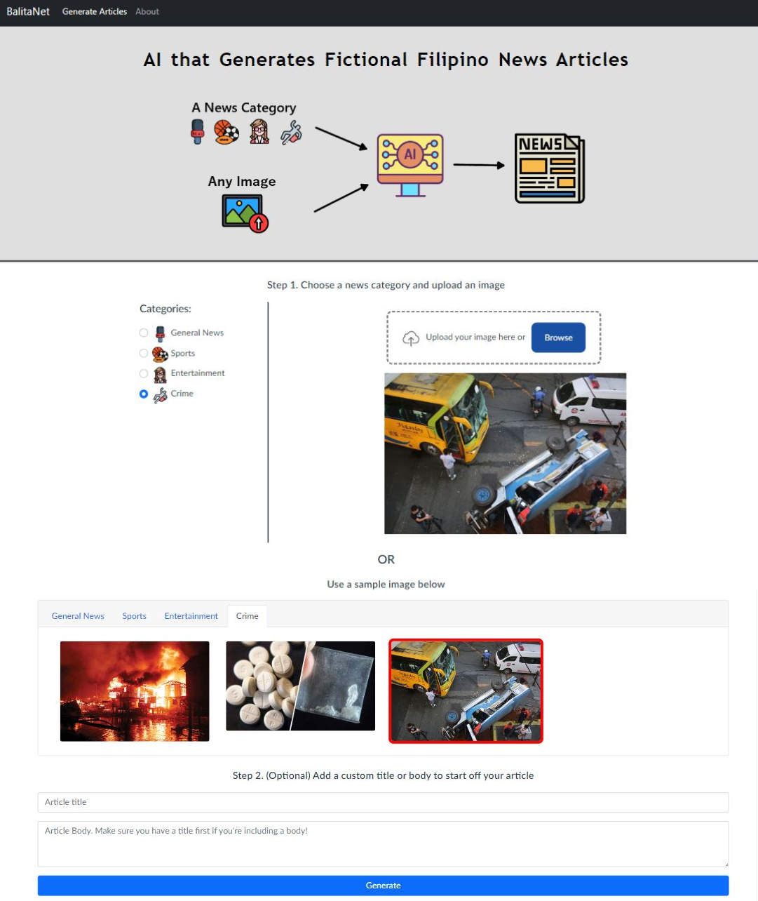

# BalitaNet - Filipino News Article Generator

This was made to explore the capabilities of current NLP architectures for language generation in the low-resource Filipino language.

Check out all the details in the [research paper](https://storage.googleapis.com/public-kenricklancebunag/Transformer-based%20Conditional%20Language%20Models%20-%20IEOM%20Submission.pdf)!

## Table of Contents
* [The Model](#model)
* [The WebApp](#webapp)
* [Installation](#installation)
* [Usage](#usage)
* [Credits](#credits)

## Model

The language model is based on GPT-2 with the [Pseudo-Self-Attention](https://arxiv.org/pdf/1908.06938.pdf) mechanism integrated in to allow it to generate based on news images and categories. A GPT-2 model was acquired that was pretrained on a large corpus of Filipino text. It was then fine-tuned on the [BalitaNLP](https://github.com/KenrickLance/BalitaNLP-Dataset) dataset for image and class conditional text generation. The model was then trained for 2 weeks on Cloud TPUs

Built with: Python, Pytorch, Huggingface

## WebApp

Generate articles with the webapp! Users can upload their own images and also start off the articles with their own titles and prompts. You can view token attention for each layer and head of the language model with color visualization. The output token probabilities for each token are also displayed in a graph.

Built with: Django, Vue

**Visualize attention of the GPT-2 model**



**View a graph of output token probabilities**



**You can upload your own image and give a title and prompt to start off the article OR you can use one of the sample images**



## Installation

1. Install [python 3.9](https://www.python.org/downloads/){target="_blank"}

2. Install the requirements

```
pip install -r requirements.txt
pip install torch==1.12.0+cu116 torchvision==0.13.0+cu116 torchaudio==0.12.0 --extra-index-url https://download.pytorch.org/whl/cu116
```

## Usage
1. Download the model

`python download_model.py`

2. Navigate to the vue frontend folder

`cd project/frontend`

3. Build the vue project

`npm run build`

4. Navigate to project folder

`cd ../`

5. Run the django server

`python manage.py runserver`

6. Open the local development server url

## Credits

Big thanks to the TPU Research Cloud program for allowing me to train on their cloud TPUs for free.
